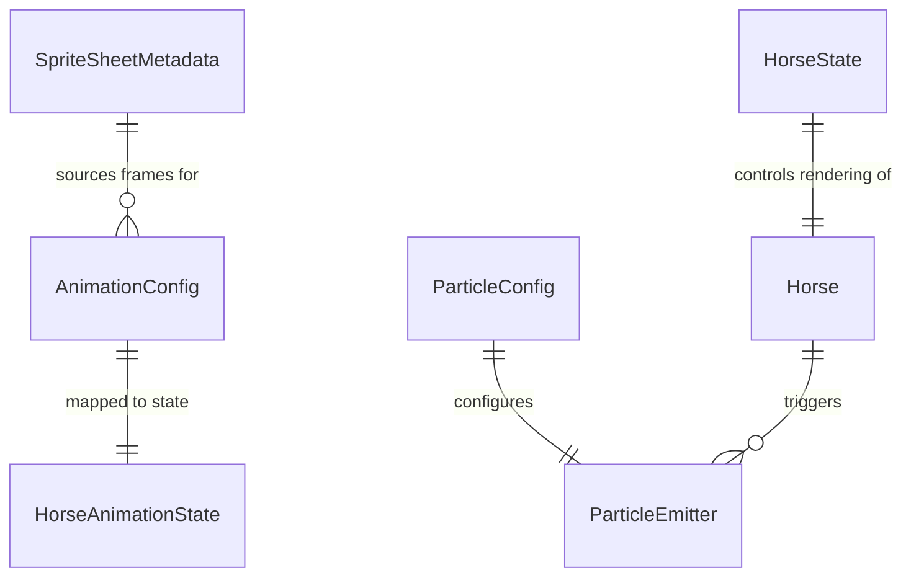

# Data Model: Visual Asset Integration

**Feature**: 003-visual-assets | **Date**: February 13, 2026  
**Purpose**: Define data structures for sprite assets, animation metadata, and state management

## Overview

This document defines the data models for sprite-based rendering, animation state machines, and asset metadata. All models are designed for type safety (TypeScript strict mode) and ease of serialization for future asset tooling.

---

## Entity: SpriteSheetMetadata

**Purpose**: Describes sprite sheet file structure and frame layout for Phaser loader

**Schema**:
```typescript
interface SpriteSheetMetadata {
  /** Unique key for Phaser texture cache */
  key: string;
  
  /** Relative path from assets/ directory */
  path: string;
  
  /** Width of each frame in pixels */
  frameWidth: number;
  
  /** Height of each frame in pixels */
  frameHeight: number;
  
  /** Total number of frames in sprite sheet (optional, derived from image if omitted) */
  totalFrames?: number;
  
  /** Sprite sheet layout type */
  layout: 'horizontal' | 'vertical' | 'grid';
  
  /** For grid layouts only: number of columns */
  gridColumns?: number;
}
```

**Example**:
```typescript
const horseIdleMetadata: SpriteSheetMetadata = {
  key: 'horse_idle',
  path: 'sprites/horse/horse_idle.png',
  frameWidth: 512,
  frameHeight: 384,
  totalFrames: 8,
  layout: 'horizontal',
};
```

**Validation Rules**:
- `frameWidth` and `frameHeight` must be > 0
- `path` must reference existing file in `assets/` directory
- `key` must be unique across all loaded sprite sheets
- `gridColumns` required if `layout === 'grid'`

**Usage**: Passed to `Phaser.Loader.LoaderPlugin.spritesheet()` in BootScene

---

## Entity: AnimationConfig

**Purpose**: Defines animation playback parameters for Phaser Animation Manager

**Schema**:
```typescript
interface AnimationConfig {
  /** Unique animation key (e.g., 'horse-idle', 'horse-eat') */
  key: string;
  
  /** Sprite sheet key to source frames from */
  spriteSheetKey: string;
  
  /** Starting frame index (0-based) */
  startFrame: number;
  
  /** Ending frame index (inclusive) */
  endFrame: number;
  
  /** Frames per second (9-24 typical for sprite animations) */
  frameRate: number;
  
  /** Repeat behavior: -1 = infinite loop, 0 = one-shot, N = repeat N times */
  repeat: number;
  
  /** Delay before animation starts (milliseconds, default: 0) */
  delay?: number;
  
  /** Delay between repeats (milliseconds, default: 0) */
  repeatDelay?: number;
  
  /** Play animation in reverse */
  reverse?: boolean;
  
  /** Yoyo mode (forward then reverse) */
  yoyo?: boolean;
}
```

**Example**:
```typescript
const horseIdleAnimation: AnimationConfig = {
  key: 'horse-idle',
  spriteSheetKey: 'horse_idle',
  startFrame: 0,
  endFrame: 7,
  frameRate: 9,
  repeat: -1, // Infinite loop
};

const horseHappyAnimation: AnimationConfig = {
  key: 'horse-happy',
  spriteSheetKey: 'horse_happy',
  startFrame: 0,
  endFrame: 7,
  frameRate: 12,
  repeat: 0, // One-shot
};
```

**Validation Rules**:
- `frameRate` must be > 0 and typically ≤ 60 (higher than game FPS is wasteful)
- `startFrame` ≤ `endFrame`
- `spriteSheetKey` must reference loaded sprite sheet
- `repeat` ≥ -1 (Phaser convention: -1 = infinite)

**Usage**: Passed to `Phaser.Animations.AnimationManager.create()` in BootScene

---

## Entity: HorseAnimationState

**Purpose**: Represents current animation state of Horse entity

**Schema**:
```typescript
type HorseAnimationState = 
  | 'idle'      // Default looping state (breathing, tail swish)
  | 'eating'    // Triggered by feed action, 2.5s duration
  | 'grooming'  // Triggered by brush drag, loops while dragging
  | 'happy'     // One-shot animation after grooming/feeding completion
  | 'walking';  // Reserved for future movement feature

interface HorseState {
  /** Current animation state */
  currentAnimation: HorseAnimationState;
  
  /** Previous animation state (for debugging/logging) */
  previousAnimation: HorseAnimationState | null;
  
  /** Timestamp when current animation started (milliseconds since epoch) */
  animationStartTime: number;
  
  /** Is animation currently locked (prevents state change during one-shot anims) */
  isLocked: boolean;
}
```

**Example**:
```typescript
const initialState: HorseState = {
  currentAnimation: 'idle',
  previousAnimation: null,
  animationStartTime: Date.now(),
  isLocked: false,
};

// After feed action
const feedingState: HorseState = {
  currentAnimation: 'eating',
  previousAnimation: 'idle',
  animationStartTime: Date.now(),
  isLocked: true, // Prevent interruption during eating
};
```

**State Transition Rules**:
```typescript
// Allowed transitions (enforced by Horse.setState())
const transitions: Record<HorseAnimationState, HorseAnimationState[]> = {
  idle: ['eating', 'grooming', 'happy', 'walking'],
  eating: ['idle'], // Auto-transition after FEEDING_CONFIG.EATING_DURATION
  grooming: ['idle'], // Auto-transition on brush release
  happy: ['idle'], // Auto-transition after one-shot animation
  walking: ['idle'], // Future feature
};
```

**Validation Rules**:
- State transitions must follow `transitions` map (no idle → idle, etc.)
- `isLocked` prevents state changes during critical animations
- `animationStartTime` updated on every state change (for debugging duration)

**Usage**: Internal state of Horse entity, not persisted in SaveSystem (visual state resets on reload)

---

## Entity: ParticleConfig

**Purpose**: Defines particle emitter settings for visual effects (hearts, sparkles, food particles)

**Schema**:
```typescript
interface ParticleConfig {
  /** Unique particle emitter key */
  key: string;
  
  /** Texture key or emoji fallback */
  texture: string;
  
  /** Particle spawn configuration */
  spawn: {
    /** Particles per burst (0 = continuous emission) */
    quantity: number;
    
    /** Spawn frequency in milliseconds (continuous mode only) */
    frequency?: number;
    
    /** Spawn area shape ('point' | 'rectangle' | 'circle') */
    emitZone?: {
      type: 'point' | 'rectangle' | 'circle';
      width?: number;
      height?: number;
      radius?: number;
    };
  };
  
  /** Particle motion configuration */
  motion: {
    /** Speed range (pixels per second) */
    speed: { min: number; max: number };
    
    /** Gravity Y (pixels per second squared, negative = upward) */
    gravityY: number;
    
    /** Initial angle range (degrees, 0 = right, 90 = down) */
    angle?: { min: number; max: number };
  };
  
  /** Particle appearance configuration */
  appearance: {
    /** Scale range (1 = original size) */
    scale: { start: number; end: number };
    
    /** Alpha/opacity range (0 = transparent, 1 = opaque) */
    alpha: { start: number; end: number };
    
    /** Tint color (0xFFFFFF = white, i.e. no tint) */
    tint?: number;
  };
  
  /** Lifespan in milliseconds */
  lifespan: number;
}
```

**Example**:
```typescript
const heartParticleConfig: ParticleConfig = {
  key: 'heart-emitter',
  texture: 'particle-heart', // Falls back to '❤️' if sprite unavailable
  spawn: {
    quantity: 5, // Burst of 5 hearts per happiness increase
  },
  motion: {
    speed: { min: 10, max: 30 },
    gravityY: -80, // Float upward
  },
  appearance: {
    scale: { start: 1, end: 0.5 }, // Shrink as they fade
    alpha: { start: 1, end: 0 },   // Fade out completely
  },
  lifespan: 1000, // 1 second lifespan
};

const sparkleParticleConfig: ParticleConfig = {
  key: 'sparkle-emitter',
  texture: 'particle-sparkle', // Falls back to '✨'
  spawn: {
    quantity: 10, // Burst of 10 sparkles per brush stroke
  },
  motion: {
    speed: { min: 20, max: 100 },
    gravityY: -50, // Slight upward drift
    angle: { min: -30, max: 30 }, // Spray outward
  },
  appearance: {
    scale: { start: 1, end: 0 },   // Shrink to nothing
    alpha: { start: 1, end: 0 },   // Fade out
  },
  lifespan: 600, // 0.6 seconds
};
```

**Validation Rules**:
- `speed.min` ≤ `speed.max`
- `scale.start` and `scale.end` ≥ 0
- `alpha.start` and `alpha.end` between 0 and 1
- `lifespan` > 0
- `texture` must reference loaded asset or valid emoji

**Usage**: Passed to `Phaser.GameObjects.Particles.ParticleEmitter` constructor in MainGameScene

---

## Entity: UISprite (Priority P2 - Future)

**Purpose**: Sprite-based UI element (icons, buttons, status bars)

**Schema**:
```typescript
interface UISprite {
  /** Unique UI element key */
  key: string;
  
  /** Texture atlas key (or single image key) */
  textureKey: string;
  
  /** Frame name/index within atlas (for multi-frame assets) */
  frame?: string | number;
  
  /** UI element type */
  type: 'icon' | 'button' | 'bar-bg' | 'bar-fill' | 'decoration';
  
  /** Interactive states (for buttons/icons) */
  states?: {
    normal: string | number;
    hover?: string | number;
    active?: string | number;
    disabled?: string | number;
  };
  
  /** Position in UI scene */
  position: { x: number; y: number };
  
  /** Display size (scales from original sprite size) */
  displaySize?: { width: number; height: number };
}
```

**Example** (Deferred to P2):
```typescript
const carrotIconSprite: UISprite = {
  key: 'icon-carrot',
  textureKey: 'ui-atlas', // From texture atlas
  frame: 'carrot-icon',
  type: 'icon',
  states: {
    normal: 'carrot-icon-normal',
    hover: 'carrot-icon-hover',
    active: 'carrot-icon-active',
    disabled: 'carrot-icon-disabled',
  },
  position: { x: 50, y: 520 },
  displaySize: { width: 48, height: 48 },
};
```

---

## Entity: BackgroundAsset (Priority P4 - Future)

**Purpose**: Static or parallax background image(s)

**Schema**:
```typescript
interface BackgroundAsset {
  /** Unique background key */
  key: string;
  
  /** Image file path */
  path: string;
  
  /** Background type */
  type: 'static' | 'parallax';
  
  /** For parallax backgrounds: scroll factor per layer */
  parallaxLayers?: {
    far: number;    // e.g., 0.2 (scrolls slower = more distant)
    mid: number;    // e.g., 0.5
    near: number;   // e.g., 0.8 (scrolls faster = closer)
  };
  
  /** Tiling behavior (for repeating backgrounds) */
  tiling?: {
    horizontal: boolean;
    vertical: boolean;
  };
  
  /** Z-index depth */
  depth: number;
}
```

**Example** (Deferred to P4):
```typescript
const stableBackground: BackgroundAsset = {
  key: 'bg-stable',
  path: 'backgrounds/stable-environment.png',
  type: 'static',
  depth: -100, // Behind all game objects
};
```

---

## Data Flow Diagram

```text
┌─────────────────────────────────────────────────────────────┐
│ BootScene.preload()                                         │
│ ┌─────────────────┐       ┌──────────────────┐             │
│ │ SpriteSheet     │──────>│ Phaser Texture   │             │
│ │ Metadata        │       │ Cache            │             │
│ └─────────────────┘       └──────────────────┘             │
└─────────────────────────────────────────────────────────────┘
                                   │
                                   ▼
┌─────────────────────────────────────────────────────────────┐
│ BootScene.create()                                          │
│ ┌─────────────────┐       ┌──────────────────┐             │
│ │ Animation       │──────>│ Phaser Animation │             │
│ │ Config          │       │ Manager          │             │
│ └─────────────────┘       └──────────────────┘             │
└─────────────────────────────────────────────────────────────┘
                                   │
                                   ▼
┌─────────────────────────────────────────────────────────────┐
│ Horse.constructor()                                         │
│ ┌─────────────────┐       ┌──────────────────┐             │
│ │ Sprite Instance │<──────│ Animation State  │             │
│ │ (Phaser.Sprite) │       │ Machine          │             │
│ └─────────────────┘       └──────────────────┘             │
│         │                          │                        │
│         ▼                          ▼                        │
│   play('horse-idle')      setState('eating')               │
└─────────────────────────────────────────────────────────────┘
                                   │
                                   ▼
┌─────────────────────────────────────────────────────────────┐
│ MainGameScene                                               │
│ ┌─────────────────┐       ┌──────────────────┐             │
│ │ Particle Config │──────>│ Particle Emitter │             │
│ │                 │       │ (hearts/sparkles)│             │
│ └─────────────────┘       └──────────────────┘             │
└─────────────────────────────────────────────────────────────┘
```

---

## Type Definitions (TypeScript)

**File**: `src/state/types.ts` (additions)

```typescript
// Animation state management
export type HorseAnimationState = 'idle' | 'eating' | 'grooming' | 'happy' | 'walking';

export interface HorseState {
  currentAnimation: HorseAnimationState;
  previousAnimation: HorseAnimationState | null;
  animationStartTime: number;
  isLocked: boolean;
}

// Sprite metadata (used in BootScene)
export interface SpriteSheetMetadata {
  key: string;
  path: string;
  frameWidth: number;
  frameHeight: number;
  totalFrames?: number;
  layout: 'horizontal' | 'vertical' | 'grid';
  gridColumns?: number;
}

export interface AnimationConfig {
  key: string;
  spriteSheetKey: string;
  startFrame: number;
  endFrame: number;
  frameRate: number;
  repeat: number;
  delay?: number;
  repeatDelay?: number;
  reverse?: boolean;
  yoyo?: boolean;
}

// Particle effects (used in MainGameScene)
export interface ParticleConfig {
  key: string;
  texture: string;
  spawn: {
    quantity: number;
    frequency?: number;
    emitZone?: {
      type: 'point' | 'rectangle' | 'circle';
      width?: number;
      height?: number;
      radius?: number;
    };
  };
  motion: {
    speed: { min: number; max: number };
    gravityY: number;
    angle?: { min: number; max: number };
  };
  appearance: {
    scale: { start: number; end: number };
    alpha: { start: number; end: number };
    tint?: number;
  };
  lifespan: number;
}
```

---

## Configuration Constants

**File**: `src/config/gameConstants.ts` (additions)

```typescript
// Sprite asset configuration
export const SPRITE_CONFIG = {
  HORSE: {
    FRAME_WIDTH: 128,
    FRAME_HEIGHT: 128,
    ANCHOR_X: 0.5,   // Center horizontally
    ANCHOR_Y: 1.0,   // Bottom vertically
    DISPLAY_SCALE: 1.5, // Scale up from 128px (192px display size)
  },
  PARTICLE: {
    HEART_SIZE: 64,
    SPARKLE_SIZE: 64,
  },
} as const;

// Animation frame rates (matches horse_phaser_meta.json)
export const ANIMATION_RATES = {
  IDLE: 9,
  WALK: 12,
  EAT: 9,
  HAPPY: 12,
  GROOM: 9,
} as const;
```

---

## Relationships



**Explanation**:
- One SpriteSheetMetadata defines frames for multiple AnimationConfigs (e.g., idle, eat, happy all from separate sheets)
- Each AnimationConfig maps to one HorseAnimationState value
- HorseState (internal) controls which animation plays on Horse entity
- ParticleConfig defines behavior of one ParticleEmitter
- Horse entity can trigger multiple particle emitters (hearts, sparkles)

---

## Validation & Constraints

### Asset File Constraints
- Sprite sheets must not exceed 2048×2048px (GPU texture limit)
- Individual frames must be power-of-2 for optimal GPU performance (128, 256, 512, etc.)
- PNG format with alpha channel required (JPEG not supported)
- Total uncompressed size of all sprites < 50MB (browser memory limit)

### Animation Constraints
- Frame rates between 1-60 FPS (clamped by Phaser)
- Animation keys must be unique across all registered animations
- Sprite sheet must be preloaded before animation creation
- One-shot animations (`repeat: 0`) must have completion handlers to prevent stuck states

### State Machine Constraints
- Only one animation plays at a time per Horse entity
- State transitions must be deterministic (no random branching)
- `isLocked` prevents mid-animation interruption (eating, happy animations)
- All states must have path back to `idle` (no dead-end states)

---

## Migration Notes

**From Current Placeholder System**:
- `Horse` currently uses `Phaser.GameObjects.Image` → Change to `Phaser.GameObjects.Sprite`
- Texture swapping (`setTexture('horse-eating')`) → Animation playback (`play('horse-eat')`)
- Tween-based animations (scale, bounce) → Sprite frame animations (complement, not replace)
- Fallback mechanism unchanged (`textures.exists()` check)

**Breaking Changes**:
- None - public API (`playEatingAnimation()`, `playHappyAnimation()`) unchanged

---

## Examples in Context

### Loading and Playing Animation
```typescript
// BootScene.preload()
this.load.spritesheet('horse_idle', 'assets/sprites/horse/horse_idle.png', {
  frameWidth: 512,
  frameHeight: 384,
});

// BootScene.create()
this.anims.create({
  key: 'horse-idle',
  frames: this.anims.generateFrameNumbers('horse_idle', { start: 0, end: 7 }),
  frameRate: 9,
  repeat: -1,
});

// Horse.constructor()
this.sprite = this.scene.add.sprite(0, 0, 'horse_idle', 0);
this.sprite.setOrigin(0.5, 1.0);
this.sprite.play('horse-idle');

// Horse.setState()
setState(newState: HorseAnimationState): void {
  if (this.isLocked || this.currentAnimation === newState) return;
  
  this.previousAnimation = this.currentAnimation;
  this.currentAnimation = newState;
  this.animationStartTime = Date.now();
  
  this.sprite.play(`horse-${newState}`, true); // Force restart
  
  // Lock during one-shot animations
  if (newState === 'happy') {
    this.isLocked = true;
    this.sprite.once(Phaser.Animations.Events.ANIMATION_COMPLETE, () => {
      this.isLocked = false;
      this.setState('idle');
    });
  }
}
```

---

**Data Model Complete**: All entities and relationships defined for P1 implementation ✅
